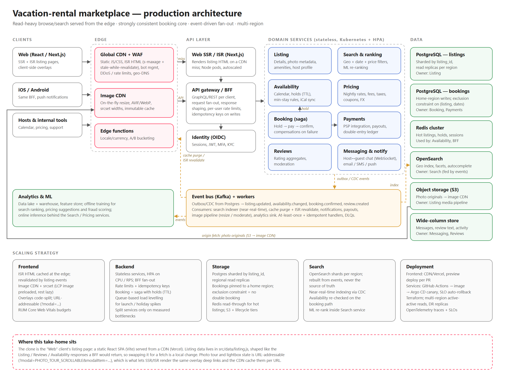

# Production architecture — vacation-rental marketplace

| File | Use |
|---|---|
| [`architecture.pdf`](architecture.pdf) | Rendered diagram, single-page vector PDF |
| [`architecture.png`](architecture.png) | Rendered diagram (2400px) |
| [`architecture.svg`](architecture.svg) | Vector version, renders on GitHub |
| [`architecture.excalidraw`](architecture.excalidraw) | Editable — open at [excalidraw.com](https://excalidraw.com) → *Open* |
| [`build-diagram.mjs`](build-diagram.mjs) | Diagram-as-code source that generates the SVG and Excalidraw files (`node docs/architecture/build-diagram.mjs`) |

The diagram describes how an Airbnb-scale product would be built. The bottom band maps the **scaling strategy**
to the five areas in the brief — frontend, backend, storage, search, deployment — and the dashed box shows
where this take-home (the Web client's listing page) sits in that picture.

**Reading the diagram:** requests flow left → right (clients → edge → API → services). Page HTML is
served from the CDN; on a miss the CDN calls the **Web SSR / ISR tier** (Next.js), which renders the page from
BFF data. App/API traffic goes edge → BFF directly. The image CDN pulls originals from S3 on a miss (the
"origin fetch" arrow); each service owns its
data store (the "Owner:" line in every data box — no shared database); dashed orange arrows are asynchronous
events through Kafka.

## Traffic shape drives the design

| Path | Volume | Consistency need | Strategy |
|---|---|---|---|
| Browse listing page, photos | Very high, spiky | Stale-OK (seconds–minutes) | CDN + ISR HTML, image CDN, Redis read-through, read replicas |
| Search | High | Near-real-time (availability) | OpenSearch geo index fed by CDC; availability re-checked on the booking path |
| Book / pay | Low | Strong, exactly-once effects | Single home-region Postgres, holds with TTL, saga + idempotency keys |
| Messaging / notifications | Medium | Ordered per thread | WebSockets + wide-column store; fan-out via event bus |

## Frontend

- **Next.js-style SSR + ISR** for listing pages: first paint is cached HTML at the edge
  (`s-maxage`, `stale-while-revalidate`), revalidated by `listing.updated` events rather than TTL alone.
  Only cache misses reach the SSR tier: stateless Node pods that autoscale on RPS and call the BFF, so
  rendering capacity scales independently of the API.
- **Islands of interactivity**: the photo tour and lightbox load on demand; their state is URL-addressable
  (`?modal=PHOTO_TOUR_SCROLLABLE&modalItem=…`) so deep links are cacheable and shareable — the clone
  already implements this contract.
- **Image CDN**: originals in object storage (S3 is the CDN's origin, fetched once per rendition); the CDN serves width-specific AVIF/WebP via `srcset`.
  The listing grid only needs ~560px and ~272px renditions, the lightbox a viewport-sized one.
- **Performance budget**: LCP image preloaded (`fetchpriority="high"`), everything below the fold lazy,
  fonts `display=swap`, RUM (Core Web Vitals) reported to observability.

## Backend

- **BFF / API gateway** shapes responses per client (web, iOS, Android) and fans out to domain services.
  Writes carry idempotency keys; per-user and per-IP rate limits protect the core.
- **Domain services** are stateless containers on Kubernetes with HPA on CPU/RPS; each owns its data.
- **Booking** is a saga: create a hold in Availability (Redis with TTL + Postgres row), authorize payment,
  confirm the booking, then release or capture. A Postgres exclusion constraint on
  `(listing_id, daterange)` makes double-booking impossible even under races.
- **Payments** keeps a double-entry ledger and isolates PCI scope.

## Storage

- **Postgres** for listings (sharded by `listing_id`, regional read replicas) and bookings (home-region
  primary per listing; cross-region async replicas for DR).
- **Redis** for hot listing documents, availability holds and sessions.
- **OpenSearch** for geo/date/price search with facets; rebuilt from events, never the source of truth.
- **Object storage** for photos; **wide-column store** for message threads and review text.
- **Data lake / warehouse + feature store** for ranking, pricing suggestions and fraud models.

## Async backbone

Transactional outbox / CDC publishes domain events to Kafka. Idempotent consumers update the search
index, invalidate caches and revalidate ISR pages, send notifications, drive payouts and feed analytics.
Failures go to dead-letter queues with alerting.

## Deployment & operations

- Frontend: static assets + ISR on a global edge platform (Vercel/CloudFront), preview deploy per PR.
- Services: containers → Argo CD canary rollouts with automatic rollback on SLO burn; Terraform for infra.
- Multi-region active-active for reads; writes for a booking go to the listing's home region.
- Observability: OpenTelemetry traces, SLOs (listing TTFB p95, search latency, booking success rate),
  structured logs, synthetic checks of the booking funnel.
- Security: WAF + bot management at the edge, mTLS inside the mesh, secrets manager, PII encryption,
  GDPR deletion propagated as an event.

## Scaling levers, in order

1. Raise CDN hit rate (ISR, image CDN, cache keys that ignore tracking params).
2. Read replicas + Redis for listing reads.
3. Scale stateless services horizontally; queue-based load levelling for spikes (e.g. holiday launches).
4. Shard search and listings by region; pin booking writes to a home region.
5. Split hot services further only when a measured bottleneck demands it.
